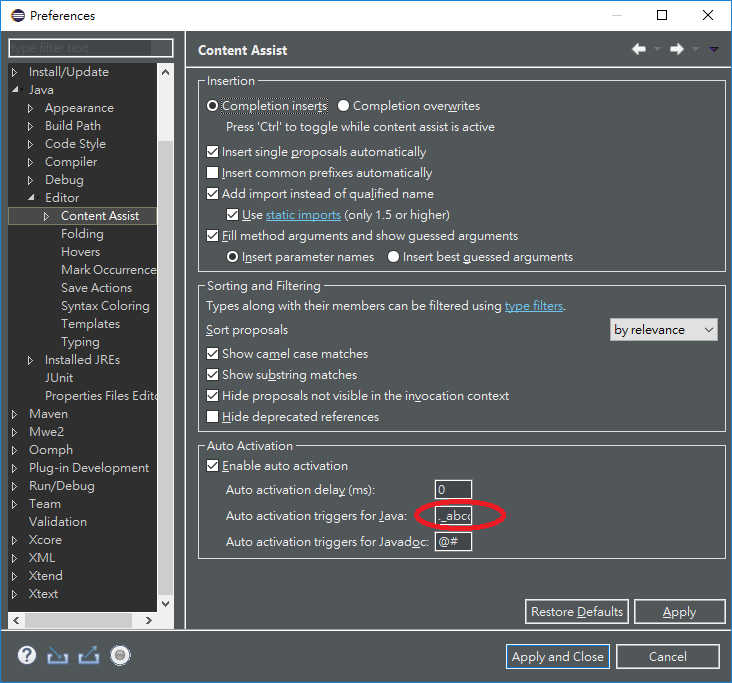
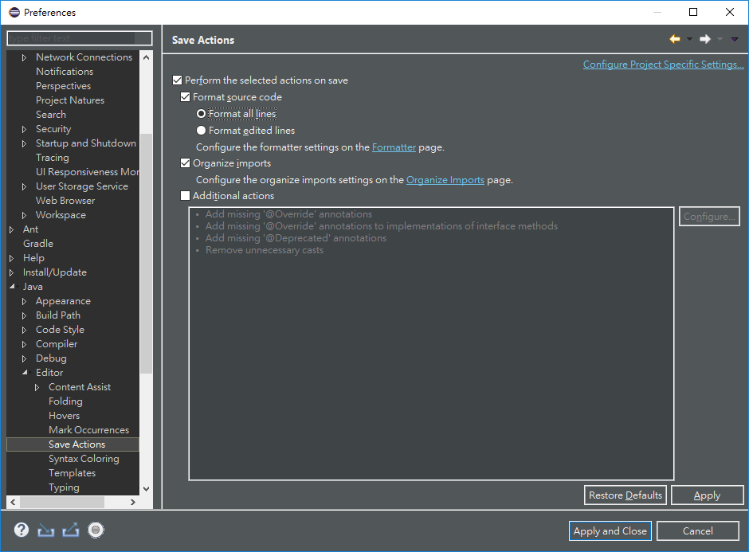

# Eclipse Slightly Extreme Speed Developing

## Hotkeys

### Added by myself

#### Refactor
- Introduce Parameter - `Alt + Shift + P`
- Convert Local Variable to Field - `Alt + Shift + F`

#### Editor
- Insert Line Above Current Line - `Ctrl + Enter` (Same as Visual Studio)
- Insert Line Below Current Line - `Ctrl + Shift + Enter` (Same as Visual Studio)

#### Navigation
- Open Declaration - `Alt + G`
- References in Workspace - `Ctrl + ```

#### Debug
- Toggle Breakpoint - `F9` (Same as Visual Studio)
- Terminate - `Shift + F5` (Same as Visual Studio)
- Step Over - `F10` (Same as Visual Studio)
- Step Into - `F11` (Same as Visual Studio)
- Step Return - `Shift + F11` (Same as Visual Studio)
- Resume - `F5` (Same as Visual Studio)
- Run to Line - `Shift + F10` (Same as Visual Studio)                                                                                     
- Rerun JUnit Test - `Ctrl + R, T`

## Useful Quick Assists

| Name            | Code Example                       | Invocation Location               |
|-----------------|------------------------------------|-----------------------------------|
| Pick out string | "abcdefgh" -> "abc" + "de" + "fgh" | select a part of a string literal |

## Configurations

### Modify trigger for `Content Assist`.

- ._abcdefghijklmnopqrstuvwxyzABCDEFGHIJKLMNOPQRSTUVWXYZ



### Enable `Save Actions` to `Format source code` and `Organize imports` automatically.



## Learned From Others

- Hotkey of Quick Access - `Ctrl + 3`
- Hotkey of Quick Outline - `Ctrl + O`
- Hotkey of Open Resource (find file quickly) - `Ctrl + Shift + R`
- Add a template for HashMap - `Map<${keyType}, ${valueType}> ${name:newName(java.util.Map)} = new HashMap<${keyType}, ${valueType}>();${:import(java.util.Map, java.util.HashMap)}`
- Hit `Enter` in string literal can break string with `+` operator. - "abcde" -> "abc" + "de"
